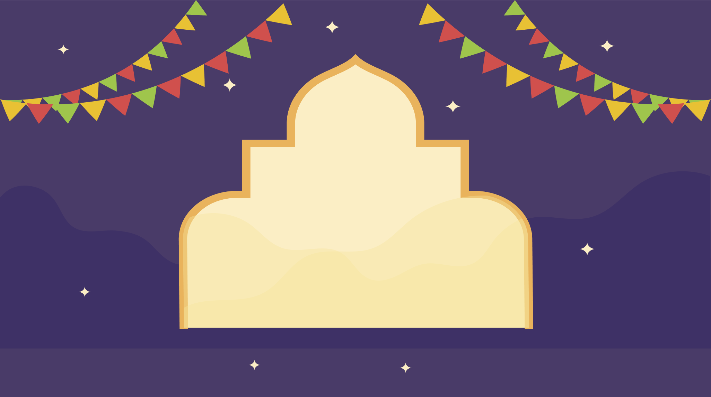

Navratri is a significant Hindu festival celebrated over nine nights, dedicated to the
 Each night is dedicated to one of the nine forms of the goddess, known as Navadurga.
The festival usually falls in September or October, coinciding with the lunar month of Ashwin. 
During Navratri, devotees engage in fasting, prayer, and various cultural activities, including
traditional dance forms like Garba and Dandiya Raas. These dances, often performed in vibrant attire,
celebrate the goddess's triumph over evil.
The final day, known as Dussehra or Vijayadashami, marks the victory of good over evil,
symbolizing the triumph of Lord Rama over the demon king Ravana. Navratri is not only a time
for spiritual devotion but also a period for family gatherings and community festivities, 
fostering a sense of unity and joy among participants. The festival highlights themes of strength,
empowerment, and the celebration of feminine energy.

---
lang: en
title: Happy Navratri
viewport: width=device-width, initial-scale=1.0
---

::: {.container-fluid}
[Code By GAURAV](#){.navbar-brand}
:::

::: {.section}
{#background} {#bottom}

## Happy Navratri {#text}

{#left} {#right} {#kite1}
{#kite2} {#fire}
:::

::: {.sec}
## Happy Navratri {#happy-navratri}

Navratri, a vibrant and culturally significant Hindu festival, is
celebrated with great enthusiasm across India. This nine-night festival
is dedicated to the worship of Goddess Durga, the embodiment of divine
feminine energy. Navratri, which means \"nine nights\" in Sanskrit,
symbolizes the triumph of good over evil and the renewal of life\'s
energy.  
  
During Navratri, devotees adorn themselves in colorful traditional
attire, perform intricate dance forms like Garba and Dandiya, and fast
as a mark of respect and devotion to the Goddess. The festival is a time
of spiritual reflection, devotion, and community bonding.  
  
Each of the nine nights is dedicated to a different form of Goddess
Durga, known as Navadurga, and her divine attributes. The festival
culminates in Dussehra, the tenth day, when the effigies of the demon
king Ravana are burned in many parts of India, marking the victory of
Lord Rama over evil.  
  
Navratri is a time to seek blessings, inner strength, and spiritual
growth. It brings people together, transcending regional and cultural
boundaries. It is a celebration of the diversity and unity that define
India\'s rich tapestry of traditions.  
  
On this auspicious occasion, I extend my warmest wishes to everyone,
irrespective of their beliefs and backgrounds, for a joyous and
prosperous Navratri. May the blessings of Goddess Durga fill your life
with love, happiness, and success. Happy Navratri!
:::

Made with by Gaurav
